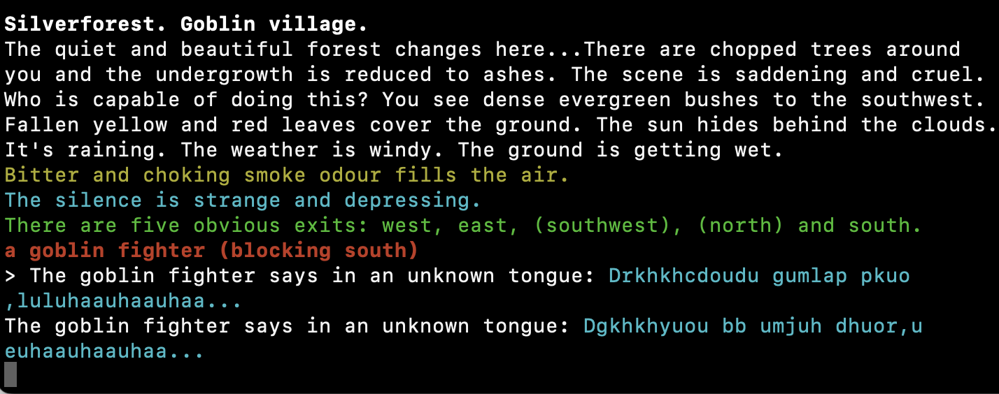

# The Goblin Village

One of my favorite gaming experiences of all time is from a Hungarian MUD, _After the Plague II_.  I was lost in the woods, southwest of Elements City, walking into dead ends, running low on food, probably walking in circles.  I saw (high perception score) a hidden path to the south, between thorn bushes.  I walked through (getting cut up in the process), and happened upon:

