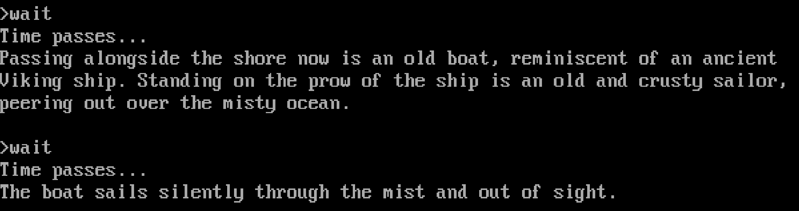

# "Hello, Sailor!"

On the shores of the Flathead Ocean, you'll eventually encounter a strange apparition:

I remember, as a kid, restoring at this point dozens of times.  I yelled all manner of things.  I followed his ship (as the description would indicate, it's gone by the time you enter the next room).  I tried everything but the actual solution, which is to yell "Hello, Sailor!".

The resolution to that joke was a long time coming, but I missed it completely, even though I was playing the three _Zork_ games, switching between them whenever I got stuck with one.

Anyway, my overachievement at object permanence and underachievement at everything else is not the point.  The point is that this melancholy and lost grandeur did affect me, as silly as _Zork_ is.  Flood Control Dam #3 has a similar effect.  I feel some degree of horror at the plight of the adventurer in the twisty passages maze; perhaps we're to assume that he never managed to find his way out... but the curse of the rusty knife is a compelling alternative explanation.

And who was it that kept shutting and barring the damned trapdoor, anyway?

The Dungeon Master, supposedly, but I don't really like that answer.  It feels a little intrusive, a little too neat.  Was the Dungeon Master a thing in _Zork I_?  It feels... plotted.

Now, interactive fiction is just that – plotted, authored.  And it probably works best like that, with the flexibility high but the editorial process working to trim the fat and ensure a clean, well-shaped story.  The best interactive fiction is dedicated to the service of the story.  As it should be.

And yet...

I feel like there's room for a more open-ended experience; one that is compelling more from the joy of exploration than careful plotting, from mystery and emergent phenomena than the satisfaction of puzzle pieces clicking into place.

I don't _know_ that this is the case, nor do I know I'm capable of manifesting it.  I'm not even sure what I'm describing, exactly.
