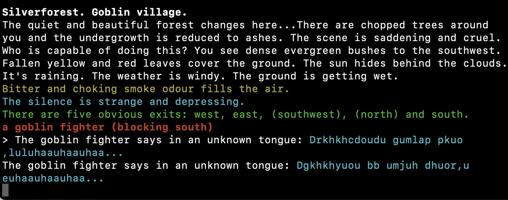

# The Goblin Village

One of my favorite gaming experiences of all time is from a Hungarian MUD, _After the Plague II_.  I was lost in the woods, southwest of Elements City, walking into dead ends, running low on food, probably walking in circles.  I saw (high perception score) a hidden path to the south, between thorn bushes.  I walked through (getting cut up in the process), and happened upon this:

Now, this in itself isn't the greatest thing, but a couple rooms south you find two goblin children who play and fight with one another.  If their ball is retrieved for them from a nearby quest, they'll play catch with each other, and with you.  If it is winter, and there is snow on the ground, they will have a snowball fight with you.  Having a snowball fight with goblin children is a fond memory of mine.

There are other interesting interactions elsewhere in the goblin village.  There appears to be a caste system, with some goblins being slaves.  Above these are fighters.  A cook is an important figure too.  There's a shaman – predictably tough – and a huge red-eyed goblin – very tough.  They have little scripts that they act out as you watch; a goblin slave grows tired and sits down to rest, then a fighter berates him, and the slave stands up again wearily.  Sometimes a fight will start, continuing until one or both pass out from exhaustion (these fights are not, in my experience, fatal, but not for lack of trying).

Throughout, the goblins punctuate the player's experience with mutterings from their own language.  This is a simple system: liquid phonemes are replaced with fricatives, etc.  Similar replacements are performed for other languages, according to some sensible rules.

Of course, the cracks will become readily apparent.  As the player learns the language, individual letters -- not syntax or words -- are transformed.  Outside of the simple scripts and their manipulation of the various systems available in the mudlib, there is no meaningful artificial intelligence.  The goblins will respawn if they are murdered, so that the next adventurer can raze the village.  And the next... and the next...

But it _can_ create meaningful experiences.
