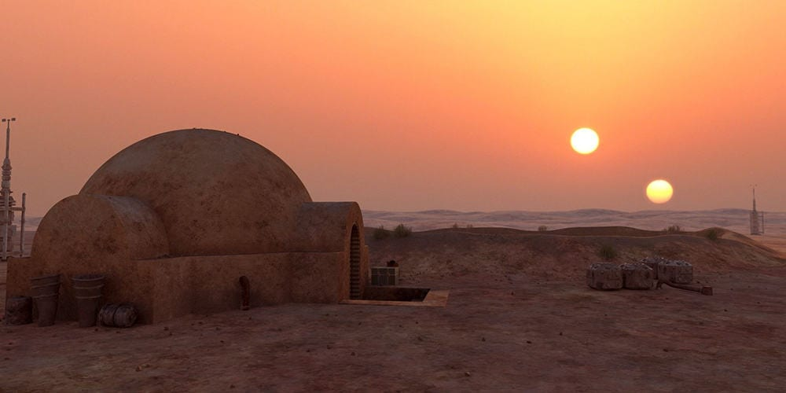

# _Cosmos_ and Tatooine

It's more of a "huh, that's interesting" moment than the amazing shot of the Star Destroyer pursuing the Corvette, and nowhere near as bizarre as the Cantina scene, but the depiction of Tatooine with two suns has stuck with me.  We tend to connect that with Tatooine's barrenness and inhospitality.  It just makes sense.



Connected with this, the ideas of what other worlds might look like from Carl Sagan's _Cosmos_: strange organisms like hot air balloons, caves overlooking cold oceans, moons of gas giants... I can't remember which were things he described and which were painted by artists.

Of course, now art from speculative fiction, art from imaginary worlds, it's immediately accessible.  Thirty-some years ago it was _highly curated_, shall we say.  A planet with two suns, or an icy waste orbiting a white dwarf, was just about as good as it gets.

I'm at best a middling mind and not likely to create a world with actually realistic and thought-provoking species.  Silicon-based organisms that breathe through their butts and have four rods and seven cones and three legs or whatever.  I'm fine with that, because this _is_ a text-based game, after all, and I don't want to say things like:

```
A flormgas enters from the west.

>l flormgas

The flormgas is a silicon-based organism that breathes through its anus.  
Its vision is exceptionally sharp and rich, owing to its four rods and seven
cones.

The flormgas waves its third leg at you menacingly.

The flormgas unsheathes its sponcül and swings it at your head!
```

Ultimately, this sort of text game needs to convey what is happening concisely, and I would rather write about goblins and elves and even nightgaunts than the Greater Yuridian Flormgas, however majestic its polyric crest might be.

_Nevertheless_, I do want to take into account the effects of different astronomical configurations.  How might goblins on Tatooine differ from goblins on Yavin IV?  Or Hoth?

**Starfall** is intended to make this kind of thing possible, by actually generating a plausible habitable star system where an adventure might take place.  Create a sun -- or binary, or even a ternary or quaternary configuration.  Put a planet in orbit around it, with variable characteristics like axial tilt and mass and composition and albedo and water content.  Perhaps give it a moon, or two, or not.

Now: what is the atmosphere like?  Does it have seasons?  How long are the day, the month, the year?  What does the day look like?  The night sky?
