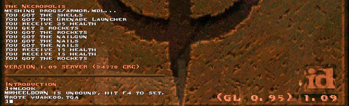
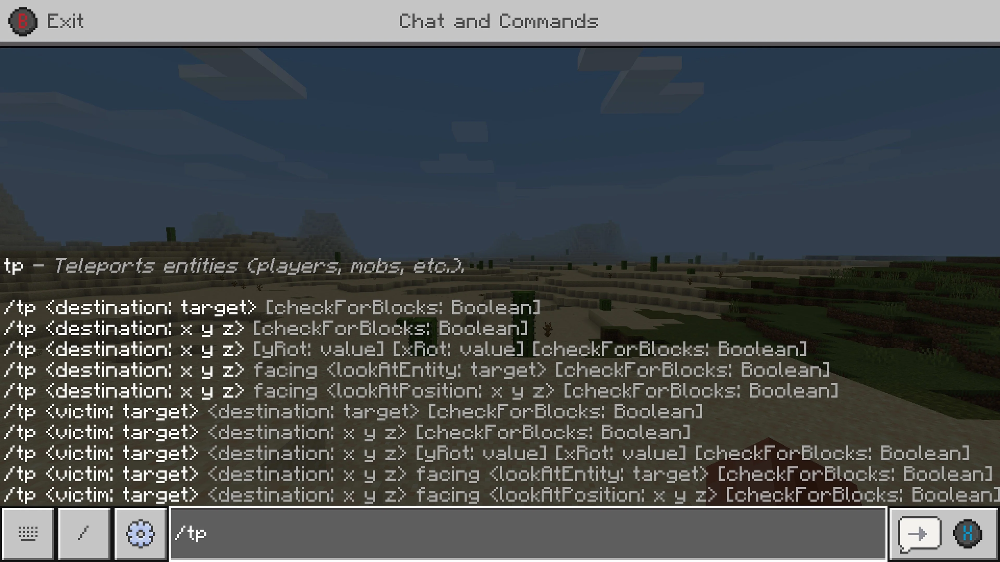

# Quake and Minecraft

It probably seems obvious now, but the Quake console kind of blew my mind when I first saw it.

I'd typed `idkfa` into _Doom_ before, and a couple of other games where you could type strings into an un-spellchecked void and possibly be rewarded with more health or bullets or whatever, but the Quake console was obviously different.  It was a whole thing that came down from the top of your screen and even stayed there after you entered a command.  It had its own inscrutable syntax.  If you typed "give health", then... well, it didn't react exactly as you expected, but it did _something_.  Sitting there in front of your beige PC with a printed out cheat sheet, you could do some very interesting things, some productive, some not-so-productive.

Much more impressive (honestly, I still barely know how to use it) is Minecraft's console:

Minecraft's console allowed you to do more than just give yourself health or move you -- it seems to provide the ability to control most of the game.  

But all of this probably pales in comparison to the in-game scripting made possible by e.g. [LPMUDs](https://mud.fandom.com/wiki/LPC), which are intended to be developed by the people playing them, even (sometimes) while the application is running.

At some point, I decided that if I ever made a game, I'd thoroughly integrate a scripting language.

The uses are many:
- scrutiny of objects during the development process for debugging, etc.
- scripting objects for automated tests
- modifying behaviors at runtime
- loading scripts to modify app or object behavior
- etc.

Some time back, while taking one of my [several](https://github.com/ndouglas/azymus) [abortive](https://github.com/ndouglas/downdelving) [attempts](https://github.com/ndouglas/whitegrove) at a roguelike, I became aware of [Robert Nystrom](https://journal.stuffwithstuff.com), and greatly enjoyed his first book, [Game Programming Patterns](http://gameprogrammingpatterns.com).  

Imagine my joy when I saw that he'd written a book, [Crafting Interpreters](http://craftinginterpreters.com), consisting of an intensive walkthrough of writing a programming language interpreter and compiler!  

So I made the decision to use Bob's Lox language as a foundation for my own language.

Of course, that's only the beginning; I need to extend the language to increase its usefulness, and I need to build out the standard library.  And, once that is complete, I need to make it so that other parts of Hornvale are able to provide their own innards for consumption to running scripts.

But for now I'm going to switch focus again...
