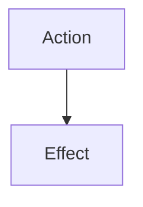

# Actions

**Actions** are "in-character", world-affecting things, not to be confused with [Commands](../commands/README.md), although both use the [Command](https://gameprogrammingpatterns.com/command.html) design pattern.

Regardless of the actor, **Actions** will generally trigger **Effects**, which are modifications to the world or the things within it.

Actions should be:
- agnostic to the reasons they are being performed
- agnostic to the world state they reference
- atomic, not trying to do more than one thing

Actions should not:
- change the world state directly

Action execution returns a `Result<Option<String>, Error>`; this is so that errors and immediate responses ("You see nothing unusual about the amulet.") can be returned immediately, outside of the Command -> Action -> Effect -> Event chain.  This should only be used for things that happen, essentially, at the speed of thought.

I was considering allowing Actions to return an alternative message when the player is not the actor, e.g. so a player might see a goblin sniff around when they perform the action.  I think it's better if visible behavior triggers an explicit Effect, though.
