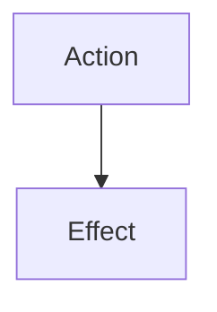

# Actions

**Actions** are "in-character", world-affecting things, not to be confused with [Commands](../commands/README.md), although both use the [Command](https://gameprogrammingpatterns.com/command.html) design pattern.

Regardless of the actor, **Actions** will generally trigger **Effects**, which are modifications to the world or the things within it.

