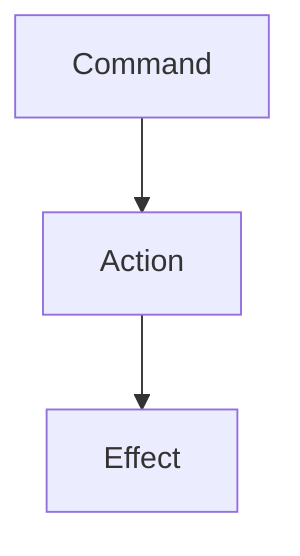

# Commands

**Commands** here are specifically used for transforming user input into IC and OOC [Actions](../actions/README.md).

From the user's perspective, Commands are mapped to [Actions](../actions/README.md), which might then have [Effects](../effects/README.md) on the world and the objects in it.

Commands also convey context about the player to the action.

