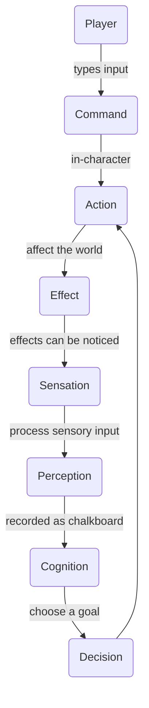

# Sensation

**Sensation** is an event system; the events are processed by [Perception](../perception/README.md).

This is not one-to-one, for instance a goblin may be burned while it is unconscious and therefore not perceive it.  Or a goblin might eat a hallucinogenic mushroom and perceive sensations that aren't there.  Sensations are objective, perceptions are subjective.

Sensation will likely be generated by [Effects](../effects/README.md).

